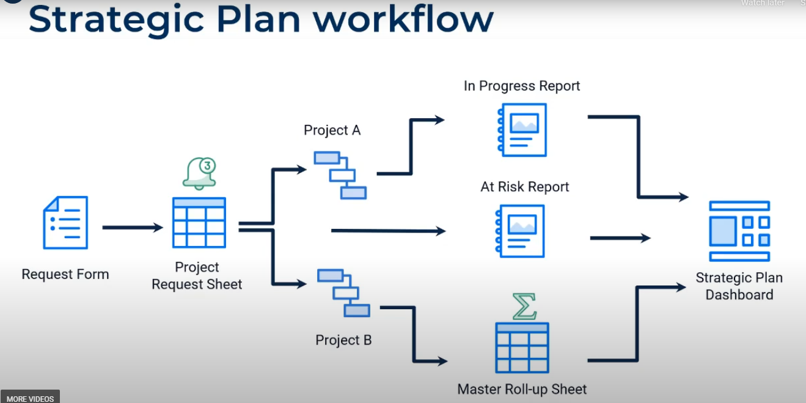

```{r setup, include=FALSE}
knitr::opts_chunk$set(echo = TRUE)
```

training resources: 

# SmartStart Onboarding

SOURCE: https://help.smartsheet.com/learning-track/best-practice-webinars/smartstart-onboarding 

4 major building blocks:

1. Sheets: The foundation of smartsheet
    + Can be viewed different ways - grid, Gantt chart, cards
    + Formulas can be used for aggregation
    + Can attach files and manage conversations
    + Can setup automated workflows
    
2. Forms: Collection information and take action
    + standardize data collection

3. Reports: Manage work across multiple sheets
    + Work across sheets with bi-directional, high level view
    + Reports are bi-directional
    + grid, calendar or gannt view
    + share as PDF or publish
    + display on dashboard
    
4. Dashboards
    + Surface key metrics without exposing underlying data
    + Use as a portal for centralzing resources for your team
    + Live, real-time updates to data as it changes
    + Charts
    + Embed web content
    
Sample work flow.



stopped at 39:46

## Dashboards

Made up of 8 widgets:
 
* Metric
* Chart
* Shortcut
* Report
* Image
* Title
* Rich text
* Web content

Workspaces are a best practice

# Maximize Your Smartsheet Experience

SOURCE: https://help.smartsheet.com/learning-track/best-practice-webinars/maximize-your-smartsheet-experience 

# Managing projects with Smartsheet

SOURCE: https://help.smartsheet.com/learning-track/best-practice-webinars/managing-projects-smartsheet 

Can automatically send email when tasks are overdue.

# Project Management for Non-Project Managers

SOURCE: https://help.smartsheet.com/learning-track/best-practice-webinars/project-management-non-project-managers 

# Building Better Sheets

SOURCE: https://help.smartsheet.com/learning-track/best-practice-webinars/building-better-sheets 

# Introduction to formulas

SOURCE: https://help.smartsheet.com/learning-track/best-practice-webinars/introduction-formulas

# Advanced Formulas

SOURCE: https://help.smartsheet.com/learning-track/best-practice-webinars/advanced-formulas

# Save Time and Do More With Automated Workflows 

SOURCE: https://help.smartsheet.com/learning-track/best-practice-webinars/save-time-and-do-more-automated-workflows

Building blocks:

* Trigger
* Condition
* Action
    + Alerta
    + Reminders
    + Approval Requests
    + Update Requests
    + Lock and Unlock row
    
Can take multiple actions in a single workflow

# Dashboards part 1 - Preparing data

SOURCE: https://help.smartsheet.com/learning-track/best-practice-webinars/dashboards-part-1-preparing-data

Before you build:

* Know your audience
* Define your purpose
* Create your data
    + Sheet summary with formula
    + Metrics sheet with cross-sheet formulas and cell linking
    + Reports

## Prepare sheet data

Use **Sheet Summary** to organize and report on critical sheet data

## Work across sheets

Use **reports** to consolodate key information from multiple sheets into a single overview.

Create a **roll-up sheet** to understand program performance.

26:30

# Questions

1. Do workspaces contain copies of work sheets or "links' to the actual content?


# TODO

* Establish relationships
* Establish critical path
